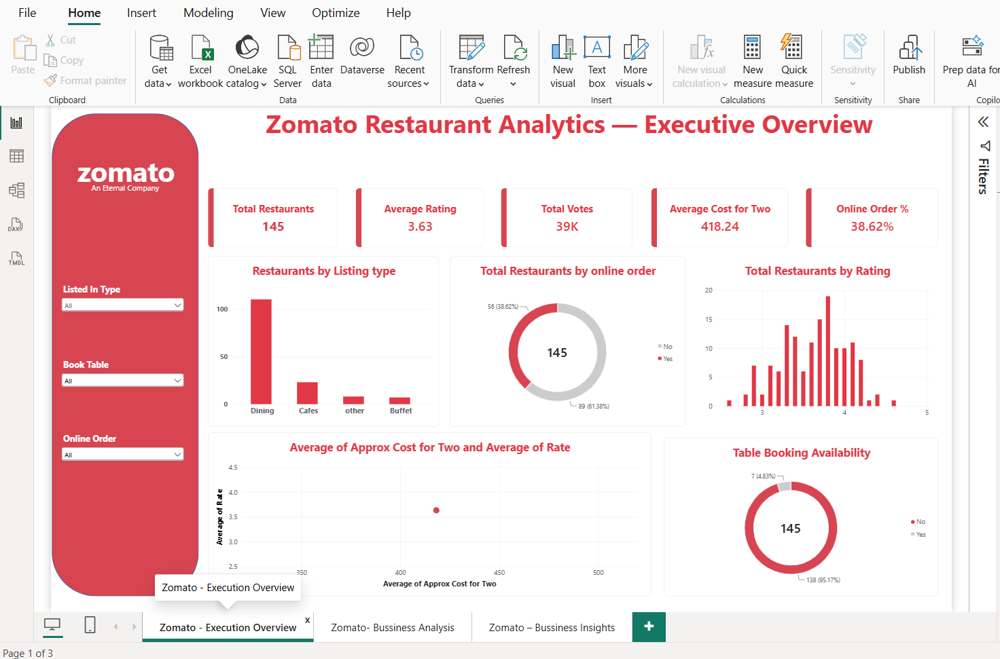
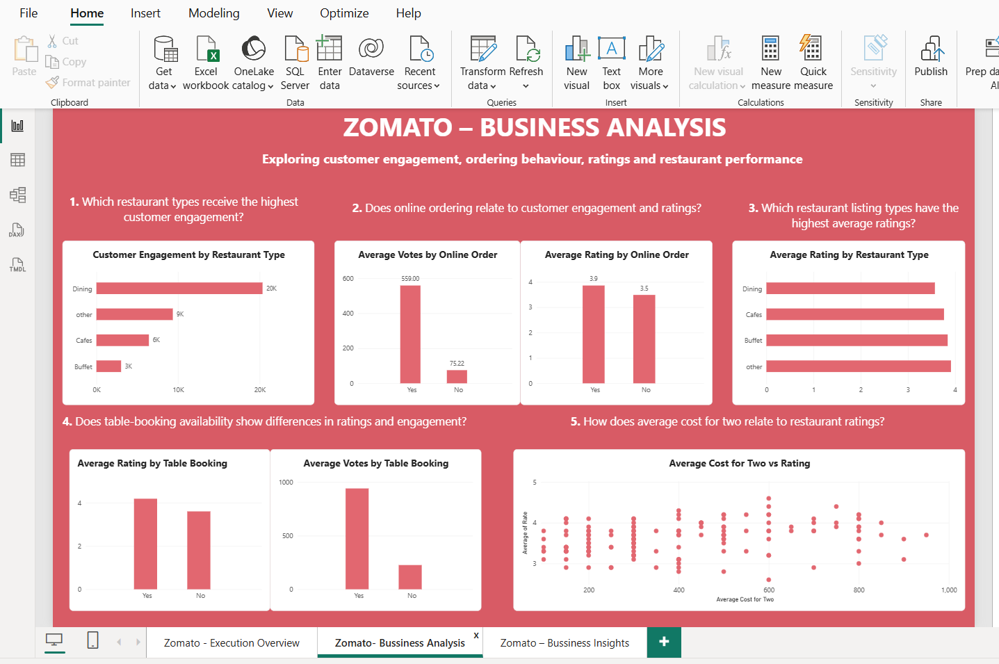

# Zomato Power BI Dashboard

An interactive Power BI dashboard for analyzing Zomato restaurant data and identifying meaningful business insights.

## 📊 Project Overview

This project uses Microsoft Power BI to analyze restaurant data and understand patterns related to restaurant types, customer engagement, ratings, online ordering, table booking, and pricing.

The dashboard converts raw restaurant data into interactive visualizations and business-focused insights.

## 📌 Dashboard Pages

### 1. Execution Overview

Provides a high-level overview of the restaurant dataset using:

- KPI cards
- Restaurant type analysis
- Rating analysis
- Customer engagement analysis
- Online ordering and table booking information
- Interactive filters

### 2. Business Analysis

The analysis focuses on five key questions:

- Which restaurant types receive the highest customer engagement?
- Does online ordering relate to customer engagement and ratings?
- Which restaurant types have the highest average ratings?
- Does table-booking availability show differences in ratings and engagement?
- How does average cost for two relate to restaurant ratings?

### 3. Business Insights

The final page summarizes the major findings from the analysis and presents business observations and recommendations based on the dataset.

## 🔍 Key Insights

- Restaurants with online ordering show higher average votes than restaurants without online ordering in this dataset.
- Restaurant types differ in customer engagement levels.
- Table-booking availability shows differences in ratings and engagement.
- Restaurant cost varies across different rating levels.
- Higher cost does not consistently correspond to higher ratings.

## 🛠️ Tools & Skills

- Microsoft Power BI
- Power Query
- Data Cleaning
- Data Visualization
- Exploratory Data Analysis
- Business Intelligence

## 🎯 Project Objective

The objective of this project is to analyze restaurant data and transform the findings into meaningful business insights through interactive Power BI visualizations.

## 📂 Project Files

- `Zomato.pbix` — Complete Power BI dashboard file
- `README.md` — Project documentation
- `page1-execution-overview.png` — Execution Overview dashboard
- `page2-business-analysis.png` — Business Analysis dashboard
- `page3-business-insights.png` — Business Insights dashboard

## 📸 Dashboard Preview

### Execution Overview

### Business Analysis

### Business Insights

## 💡 Business Value

The dashboard helps understand customer engagement patterns and explores how factors such as restaurant type, online ordering, table booking, ratings, and pricing relate to restaurant performance.

## 📌 Project Outcome

This project demonstrates the process of transforming restaurant data into an interactive Power BI dashboard and communicating analytical findings through business-focused insights and recommendations.
